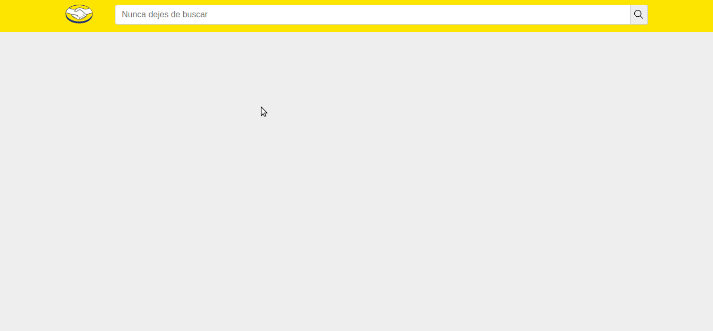

# ml-front-test

[Como Correr el proyecto](#como-correr-el-proyecto)
  - [Instalación](#instalacion)

[Resultados de busqueda](#resultados-de-busqueda)

[Detalle de producto](#detalle-de-producto)

[Mensajes de error](#mensajes-de-error)

[Comentarios Generales](#comentarios-generales)


## Como Correr el proyecto

### Instalación

```
git clone https://github.com/dio19/ml-front-test
cd ml-front-test
npm install

```
Levantar la app:

```
npm run all (con este unico comando levantamos el servidor creado con Node JS y Express y a su vez el Front creado con React JS utilizando HOOKS, REACT ROUTER, HISTORY, y como State Management CONTEXT )

```

Automaticamente abrira el navegador en http://localhost:3000/ desde donde podemos visualizar el FrontEnd. El BackEnd queda corriendo en http://localhost:4000/

### Resultados de busqueda

> 

Al buscar por palabras clave, estas son pusheadas al HISTORY lo que permite administrar la pila de historial y navegar con mayor facilidad hacia los resultados de busqueda. Una vez que se pushea el path con la query, por ejemplo, ``` http://localhost:3000/items?search=nokia ``` el navegador cambia la url y realiza el fetch al endpoint ``` http://localhost:4000/api/items?q=nokia ``` a traves del CONTEXT. Implemente CONTEXT ya que quito la logica de ir a buscar la data a la API de mi componente app.js y ademas es informacion que me podria servir desde cualquier lugar de la app. En el desafio piden que solo renderice los primeros 4 items, para implementar este requisito utilice el limit que especifican en la documentacion de la API de MercadoLibre, siguiendo el ejemplo quedaria de la siguiente manera ``` https://api.mercadolibre.com/sites/MLA/search?q=nokia&limit=4 ```

### Detalle de producto

> 

En el desafio pedian como requisito que las imagenes del detalle del producto tengan un ancho maximo de 680px para eso lo que hice fue desde de la API filtrar del arreglo de imagenes que te vienen cuando le pegas al detalle del producto por id desde la API de MercadoLibre, utilizando un size mayor a 400px. Algo que me parecio oportuno implementar fue hacer un fetch asincrono para traerme la data del detalle del producto, ayudando a optimizar considerablemente el tiempo de carga. 
El detalle de producto se renderiza al hacer click en el resultado de la busqueda, utilizando el LINK de REACT ROUTER navego hacia el path ``` http://localhost:3000/items/iddelproducto ``` llamando al componente que se encargar de realizar el fetch al endpoint utilizando dinamicamente el id con useParams de REACT ROUTER.

### Mensajes de error

[03](./gif/busquedainvalida.gif)

[04](./gif/idinvalido.gif)

### Comentarios Generales

Toda la app esta estructura bajo el patron de diseno MVC, donde los modelos estan especificados en la API de como tiene que estar modela o formateada la data, los contenedores son los componentes que estan agrupados en la carpeta pages que se encargan de la logica de negocio, le pegan a los endpoint especificos y reciben la data para dejarla lista para que el resto de los componentes que no estan en esta carpeta, las vistas,  reciban la data y solo cumplan la funcion de renderizarla.

Ambas pages, ya sea la de los resultados de la busqueda como la del detalle del producto, utilizan el componente loader mientras estan recibiendo la data del Backend.

La app es totalmente responsive, para esto implemente un sistema de grillas y cree un componente layout el cual es reutilizado por las diferentes pages renderizando siempre componentes Mobile First, ademas de usar Media Queries en cada uno de los estilos de cada componente para cambiar propiedades dependiendo el punto de quiebra en donde se encuentre el ancho de pantalla.

Las variables de estilo que repeti con mas frecuencia las declare una unica vez en el archivo variables dentro de la carpeta styles, y luego las fui importando en cada uno de los estilos de cada componente.

Al tener la pantalla un ancho menor igual a 425px, que es uno de los break points, utilizo los logos 2x para al agrandar el tamano de los mismos obtener mejor resolucion.
